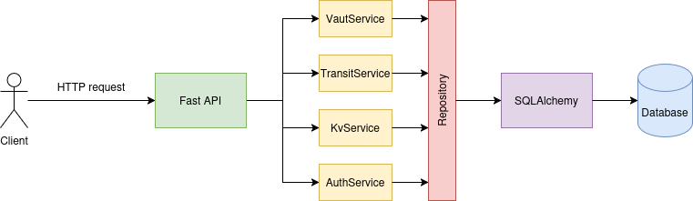

# Aegis

Aegis is a secret management and cryptographic service inspired by HashiCorp Vault and AWS Key Management Service (KMS). It provides secure secret storage and cryptographic operations through a centralized service, ensuring that sensitive data and encryption keys are never exposed to client applications.

---

## Features

- **Secure Secret Management** – Store and retrieve encrypted secrets using AES-256-GCM with authenticated encryption.
- **Transit Cryptography Service** – Perform encryption, decryption, digital signing, and signature verification without exposing cryptographic keys.
- **Vault Lifecycle Management** – Initialize, seal, and unseal the vault using a passphrase-derived master key to protect the Data Encryption Key (DEK).
- **Authentication, Authorization & Audit Logging** – Secure access with bearer-token authentication, ownership-based authorization, and immutable audit trails.
- **Production Observability** – Built-in Prometheus metrics, health/readiness endpoints, structured logging, and request tracing for operational monitoring.

---

## Architecture

---

## API Reference
#### Health & Observability

| Method | Endpoint | Decription |
|--------|----------|------------|
| GET    | /health  | Liveness probe. Returns whether the service is running.|
| GET    | /ready  | Readiness probe. Checks database connectivity and vault state before reporting the service as ready.|
| GET    | /metrics | Exposes Prometheus metrics including request counts, latency, vault status, authentication failures, KV operations, and Transit operations.|

#### Vault Management

| Method | Endpoint | Decription |
|--------|----------|------------|
| POST   | /v1/vault/init | Initializes the vault by deriving the master key from the provided passphrase and creating the encrypted Data Encryption Key (DEK).|
| POST   | /v1/vault/unseal | Unlocks the vault by decrypting the DEK using the passphrase-derived master key.|
| POST   | /v1/vault/seal | Removes the decrypted DEK from memory and locks the vault.| 
| GET    | /v1/vault/status | Returns the current vault state (uninitialized, sealed, or unsealed).| 

#### Authentication

| Method | Endpoint | Decription |
|--------|----------|------------|
| POST   | /v1/auth/register | Creates a new user account with an Argon2id-hashed password. |
| POST   | /v1/auth/login | Authenticates a user and issues a bearer session token. |
| POST   | /v1/auth/logout | Revokes the current session token. | 
| GET    | /v1/auth/me | Returns information about the authenticated user. | 

#### Key-Value Secret Engine

| Method | Endpoint | Decription |
|--------|----------|------------|
| PUT    | /v1/kv/{path} | Encrypts and stores a JSON secret at the specified path. |
| GET    | /v1/kv/{path} | Retrieves and decrypts a secret from the specified path. |
| DELETE | /v1/kv/{path} | Permanently deletes a secret. |

#### Key Management

| Method | Endpoint | Decription |
|--------|----------|------------|
| POST   | /v1/transit/keys/{name} | Creates a new cryptographic key (symmetric or Ed25519 signing key). |
| POST   | /v1/transit/keys/{name}/disable | Disables a key, preventing further cryptographic operations. |
| DELETE | /v1/transit/keys/{name} | Permanently destroys a key. |

#### Cryptographic Operations

| Method | Endpoint | Decription |
|--------|----------|------------|
| POST   | /v1/transit/keys/{name}/encrypt | Encrypts Base64-encoded plaintext using the specified key. |
| POST   | /v1/transit/keys/{name}/decrypt | Decrypts ciphertext produced by the Transit engine. |
| POST   | /v1/transit/keys/{name}/sign | Generates an Ed25519 digital signature for a message. | 
| POST   | /v1/transit/keys/{name}/verify | Verifies an Ed25519 digital signature. | 

#### Audit

| Method | Endpoint | Decription |
|--------|----------|------------|
| GET    | /v1/audit | Returns the authenticated user's audit trail with optional filtering by principal, action, timestamp, and pagination. |

---

